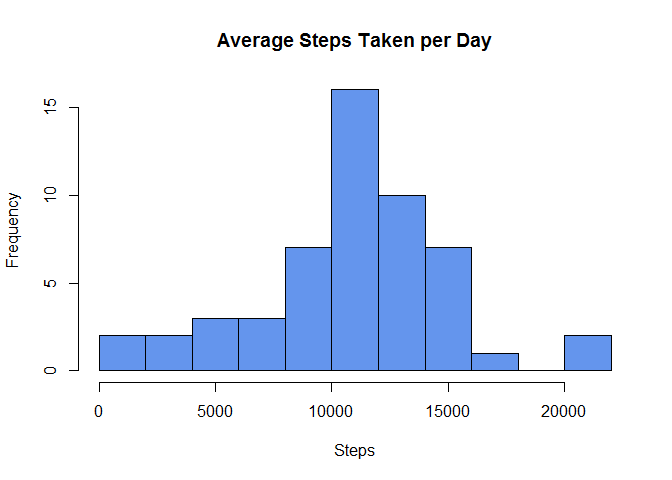
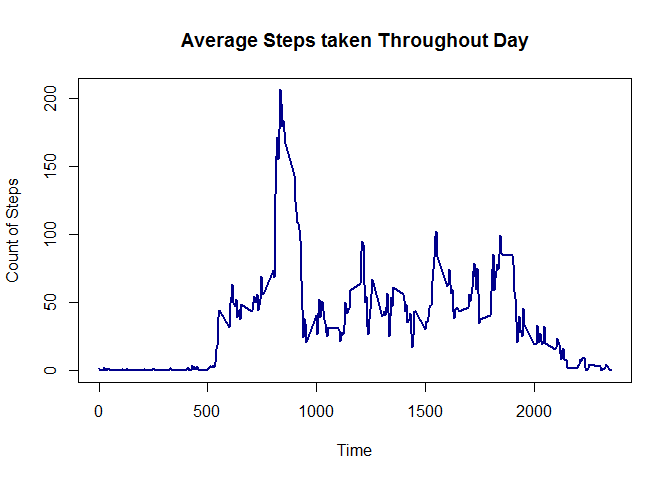
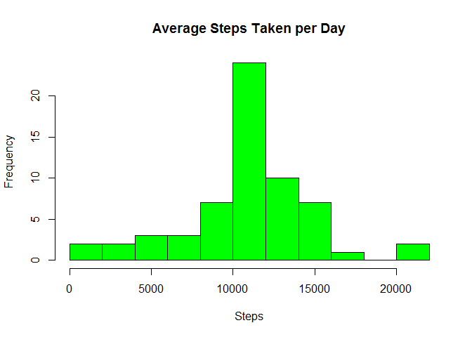
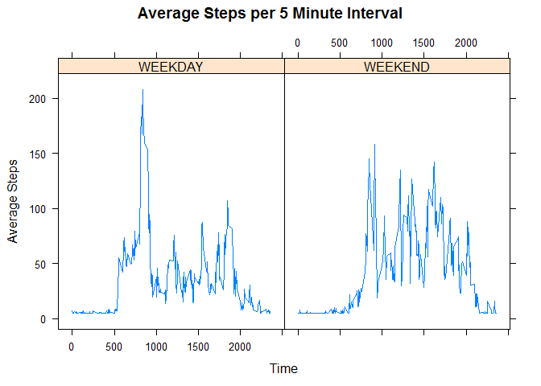

# Reproducible Research: Peer Assessment 1


## Loading and preprocessing the data
Loading in the activity data and printing a summary of the variables


```r
unzip('activity.zip')
data<-read.csv('activity.csv', header=T)
summary(data)
```

```
##      steps                date          interval     
##  Min.   :  0.00   2012-10-01:  288   Min.   :   0.0  
##  1st Qu.:  0.00   2012-10-02:  288   1st Qu.: 588.8  
##  Median :  0.00   2012-10-03:  288   Median :1177.5  
##  Mean   : 37.38   2012-10-04:  288   Mean   :1177.5  
##  3rd Qu.: 12.00   2012-10-05:  288   3rd Qu.:1766.2  
##  Max.   :806.00   2012-10-06:  288   Max.   :2355.0  
##  NA's   :2304     (Other)   :15840
```

## What is mean total number of steps taken per day?

Finding the mean total number of steps taken each day.  

```r
a<-aggregate(data$steps~data$date, FUN=sum, na.action=NULL)
```

Creating a histogram of the average steps taken per day

```r
hist(a[,2], main="Average Steps Taken per Day", xlab="Steps", col="cornflowerblue", breaks=10)
```

 

Printing the mean and median steps taken per day

```r
mean.steps<-mean(a[,2], na.rm=T)
mean.steps
```

```
## [1] 10766.19
```

```r
median.steps<-median(a[,2], na.rm=T)
median.steps
```

```
## [1] 10765
```

## What is the average daily activity pattern?

Finding the average number of steps taken in each 5 minute interval of the day

```r
b<-aggregate(data$steps~data$interval, na.rm=TRUE, FUN=mean, na.action=NULL)
```

Plotting the average steps taken throughout the day

```r
plot(b[,1], b[,2], type="l", xlab="Time", ylab="Count of Steps", 
  main="Average Steps taken Throughout Day", col="darkblue", lwd=2)
```

 

Printing the most active 5 minute segment of the day, on average.

```r
max.steps.time<-b[which.max(b[,2]),1]
max.steps.time
```

```
## [1] 835
```


## Imputing missing values

Identifying how many missing values exist in the data

```r
na.count<-sum(is.na(data$steps))
na.count
```

```
## [1] 2304
```

Creating a second version of the data where all empty values are replaced with the mean number of steps taken in a 5 minute interval.  I used this simple way of imputing NA values since the instructions said the approach did not have to be sophisticated. 

```r
data2<-data
for (i in 1:length(data$steps)){
  data2$steps[i]<- ifelse(is.na(data2$steps[i]), mean(data$steps, na.rm=T), data2$steps[i])
}
```

Creating a histogram of the average steps taken per day using the imputed values instead of NAs


```r
c<-aggregate(data2$steps~data2$date, FUN=sum)
hist(c[,2], main="Average Steps Taken per Day", xlab="Steps", col="green", breaks=10)
```

 

Comparing the mean and median steps taken per day with NAs in the data with the data with no NAs.  The mean number of steps has remained unchanged.  This makes sense since I am using the mean number of steps each 5 minutes as my replacement for NAs.  The median steps taken has increased slightly. This also makes sense since the distribution of number of steps every 5 minutes is right skewed


```r
mean.steps.na<-mean(c[,2])
mean.steps.na
```

```
## [1] 10766.19
```

```r
mean.steps.na-mean.steps
```

```
## [1] 0
```

```r
median.steps.na<-median(c[,2])
median.steps.na-median.steps
```

```
## [1] 1.188679
```

## Are there differences in activity patterns between weekdays and weekends?

Creating a factor variable that takes the values of "WEEKEND" and "WEEKDAY" 

```r
data2$day <- weekdays(as.Date(data2$date))
data2$weekend[data2$day=="Saturday" | data2$day=="Sunday"]<-"WEEKEND"
data2$weekend[data2$day!="Saturday" & data2$day!="Sunday"]<-"WEEKDAY"
```

Creating a plot with two panels.  One representing the average level of activity on a weekday and the other for a weekend day


```r
f<-aggregate(data2$steps~data2$interval+data2$weekend, FUN=mean)
library(lattice)
xyplot(f[,3] ~ f[,1] | f[,2], type = c("l"), xlab="Time", ylab="Average Steps", main="Average Steps per 5 Minute Interval")
```

 
